# Flawil Beavers

## Future-Engineers_2025


| Opening Challenge | Obstacle Challenge |
|--------------|---------------|
| [](https://youtu.be/OofLgNROook) | [](https://youtu.be/P_mGKfEbACU) |
| [](https://youtu.be/OofLgNROook) | [](https://youtu.be/P_mGKfEbACU) |

**This is the GitHub repository for team Flawil Beavers for WRO 2025. You'll find our documentation in this README.**

---

## Contents

- [Introduction](#introduction)

- [Mobility Management](#mobility-management)
  - [Assembly Instructions](#assembly-instructions)
    - [Step 1 – Preparations](#step-1-preparations)
    - [Step 2 – Base Plate and Drive Assembly](#step-2-base-plate-and-drive-assembly)
    - [Step 3 – LEGO Component Assembly](#step-3-lego-component-assembly)
    - [Step 4 – Steering Axle](#step-4-steering-axle)
    - [Step 5 – Computer Mounting Plate](#step-5-computer-mounting-plate)
    - [Step 6 – Installing the Electronics](#step-6-installing-the-electronics)
    - [Step 7 – Wiring](#step-7-wiring)
    - [Step 8 – Enclosure Assembly](#step-8-enclosure-assembly)
    - [Step 9 – Hardware Finalization](#step-9-hardware-finalization)
    - [Step 10 – Software Installation and Setup](#step-10-software-installation-and-setup)
  - [Structural and Mechanical Design](#structural-and-mechanical-design)

- [Power and Sense Management](#power-and-sense-management)  
  - [Power Management](#power-management)  
  - [Sense Management](#sense-management)

- [Wiring Diagram](#wiring-diagram)

- [Bill of Materials](#bill-of-materials)

- [Obstacle Management](#obstacle-management)  
  - [Software Architecture](#software-architecture)  
  - [Opening Race](#opening-race)  
  - [Obstacle Race](#obstacle-race)  
    - [Colour Detection](#colour-detection)  
    - [Wall Following](#wall-following)

- [Own platform for streams](#own-platform-for-streams)

- [Firmware Running on the Arduino](#firmware-running-on-the-arduino)  
  - [Overview of custom Firmware Operation](#overview-of-custom-firmware-operation)  
  - [System-Level Interaction Diagram](#system-level-interaction-diagram)

- [Photos](#photos)  
- [Videos](#videos)

- [Enabling Reproducibility](#enabling-reproducibility)

- [Future Improvements](#future-improvements)


---

## Introduction

We, **Damian Hardegger** and **Philipp Kündig**, form the WRO team **Flawil Beavers**. Since 2019, we have been actively participating in the World Robot Olympiad, starting in the RoboMission category where we achieved several successful results. In 2024, we decided to take on a new challenge and moved into the Future Engineers category. There, we gained our first experience with autonomous driving and vehicle robotics — and even managed to win the Open Championships in Italy.

This documentation provides a complete technical overview of our Future Engineers project, including the mechanical design, electronics, software architecture, and our development process. The goal of this README is to offer a clear reference for judges, mentors, and other teams who may benefit from our approach, CAD files, wiring diagrams, and assembly instructions.

We believe in transparent engineering and hope that sharing our work contributes to the WRO community and inspires teams entering the Future Engineers category.

---

## Mobility Management

### Assembly Instructions

Below you’ll find a concise assembly guide covering all major build steps.

---

<details><summary><span style="font-size:1.4em; font-weight:700;">Step 1 – Preparations</span></summary>

Gather all required materials according to the [**Bill of Materials (BOM)**](#bill-of-materials) and print all necessary **[3D‑Printed‑Parts / CAD & STL](./CAD/Seperate%20Parts/)**.  
Use **M3 screws** and **M3nS/M3n nuts** for all mechanical components, and **M2 screws** with **M2n nuts** for electronic parts.

> ⚠️ **Note:**  
> For the **base plate** and **battery cover**, **magnets must be inserted after the printing process**.  

</details>

---

<details><summary><span style="font-size:1.4em; font-weight:700;">Step 2 – Base Plate and Drive Assembly</span></summary>

Take the printed **[base plate](./CAD/Seperate%20Parts/Base.3mf)** and begin by mounting the two **motors**.  
The **drive motor** is positioned in the center and secured with the [DC motor cover](./CAD/Seperate%20Parts/DC%20motor%20cover.3mf).  
Place a **coupling** between the motor shaft and the **LEGO axle** – we recommend a **metal coupling**, though [Shaft](./CAD/Seperate%20Parts/Shaft.3mf) can also be used.

Next, install the [Gearbox back](./CAD/Seperate%20Parts/Gearbox%20back.3mf) as well as the [Gearbox front](./CAD/Seperate%20Parts/Gerbox%20front.3mf) and [Gearbox front inset](./CAD/Seperate%20Parts/Gearbox%20front%20inset.3mf) on the base plate.  
Attach the **servo motor** using [Servo shaft](./CAD/Seperate%20Parts/Servo%20shaft.3mf) + [Servo shaft lego](./CAD/Seperate%20Parts/Servo%20shaft%20lego.3mf) and ensure all fasteners are tight.

Route the **motor cables to the side**, so they remain accessible later.  
Finally, verify that **all shafts are properly aligned and firmly fastened**.

|<br> **Base plate**|  <br> **DC motor cover** |  <br> **Shaft** |
|---|---|---|
| <br> **Gearbox back**|  <br> **Gerbox front** |  <br> **Gearbox front inset** |

 <br> **Servo shaft** | <br> **Servo shaft lego** |
|---|---|

</details>

---

<details><summary><span style="font-size:1.4em; font-weight:700;">Step 3 – LEGO Component Assembly</span></summary>

Attach the **LEGO components** to the 3D-printed parts as shown below.

**[LEGO Assembly](CAD/Lego_Chassis.io)**
<br>
<br>

<p align="center">
    
    <br>
    <strong>LEGO Chassis</strong>
</p>

Ensure all connections fit snugly and that no parts are misaligned.

</details>

---

<details><summary><span style="font-size:1.4em; font-weight:700;">Step 4 – Steering 
Axle</span></summary>

Check that you have installed both **gearboxes (step 2)** onto the base plate, then complete the **steering shaft assembly**.  
A **metal rod** is recommended; alternatively, a **16 cm LEGO steering bar** can be used.

These components secure all shafts in place and ensure stable **gear engagement**.  
Verify that all gears rotate smoothly and are properly meshed.

</details>

---

<details><summary><span style="font-size:1.4em; font-weight:700;">Step 5 – Computer Mounting Plate</span></summary>

Attach [Raspberry holder](./CAD/Seperate%20Parts/Rasbperry%20holder.3mf), the **mounting plate for the Raspberry Pi and the [cover top lower](./CAD/Seperate%20Parts/Cover%20top%20lower.3mf)**, to the supports installed in the previous step.  
Then, mount the [Camera mount](./CAD/Seperate%20Parts/Camera%20mount.3mf) on top of this plate as shown in the image.

**[Complete vehicle model](./CAD/Car%20v87.step)**

|  <br> **Raspberry holder** |  <br> **cover top lower** |  <br> **Camera mount** |
|---|---|---|

<br>
Make sure the alignment is precise so that cables and connectors remain easily accessible.

</details>

---

<details><summary><span style="font-size:1.4em; font-weight:700;">Step 6 – Installing the Electronics</span></summary>

Flash the **micro SD card for the Raspberry Pi** and the **Arduino Nano** according to step 1 in **[software documentation](#enabling-reproducibility)**.

Mount the **Raspberry Pi** onto the upper plate.  
The **Arduino Nano** will be connected later and should remain **temporarily unattached** for now.

Carefully turn the robot upside down and install the remaining **electrical components** on the underside, following the reference picture.


Use the washers and fastening materials:

|  <br> **[Voltage regulator](./CAD/Seperate%20Parts/Voltager%20regulator%20spacer%20top.3mf)**| <br> **[Motor driver](./CAD/Seperate%20Parts/Motor%20driver%20spacer%20top.3mf)** | <br> **[Gyro spacer](./CAD/Seperate%20Parts/Gyro%20spacer.3mf)**|
|---|---|---|

> 💡 **Tip:**  
> Use **nylon washers or plastic spacers** under PCBs to prevent short circuits.

</details>

---

<details><summary><span style="font-size:1.4em; font-weight:700;">Step 7 – Wiring</span></summary>

Follow the provided **[Wiring Diagram](#wiring-diagram)** to correctly interconnect all components.  
The **Arduino Nano** can temporarily remain on the top side for easy access.

Solder the wires of the power components on the underside and use **connectors** where possible to simplify maintenance.  
For the main power supply, **WAGO terminals** can be placed in the front interior compartment of the robot.

> ⚠️ **Warning:**  
> Double-check **all GND and power connections**.  
> Incorrect wiring may damage components or even cause **short circuits and fire hazards**.

</details>

---

<details><summary><span style="font-size:1.4em; font-weight:700;">Step 8 – Enclosure Assembly</span></summary>

Place [Bottom cover](./CAD/Seperate%20Parts/Bottom%20cover.3mf) over the wiring from underneath – it should **snap into place securely**.  
Then, flip the robot back upright and prepare the [top cover](./CAD/Seperate%20Parts/Cover%20top%20upper.3mf).

Mount the **toggle switches** and the **status LED** as shown, and connect them directly to the Arduino.

Before fully closing the housing:

1. Connect the **camera module** and route the ribbon cable through the opening.  
2. Link the **Arduino Nano** to the **Raspberry Pi** using a **USB-A to Micro-USB cable**.  
3. Once completed, install and fasten the housing completely.

|  <br> **Bottom cover** |  <br> **Top cover** |
|---|---|

</details>

---

<details><summary><span style="font-size:1.4em; font-weight:700;">Step 9 – Hardware Finalization</span></summary>

Mount the **camera** at the front of the robot.  
Carefully attach the **lens**, making sure it is free of dust and properly focused.  
Tighten it fully to prevent image blur caused by vibration.

To finish:

- Install the [rear spoiler](./CAD/Seperate%20Parts/spoiler_full_2.3mf) (for that extra aerodynamic performance 😎).
- Don't forget to install the [Battery holder](./CAD/Seperate%20Parts/Battery%20holder.3mf).
- Attach the **wheels**.

Your robot’s **hardware assembly** is now complete and ready for operation.

|  <br> **Rear spoiler 😎** |  <br> **Battery holder** |
|---|---|

</details>

---

<details><summary><span style="font-size:1.4em; font-weight:700;">Step 10 – Software Installation and Setup</span></summary>

Carefully read through the **[software documentation](#enabling-reproducibility)** and install all required software packages on the **Raspberry Pi** and **Arduino Nano**.  
Upload the corresponding **firmware, scripts, and configuration files** as described in the software section.

> **Congratulations!**  
> Your robot is now fully assembled and ready for its first run.  
> Enjoy driving, experimenting, and improving your creation!

</details>

---

<!-- Mobility management discussion should cover how the vehicle movements are managed. What motors are selected, how they are selected and implemented.
A brief discussion regarding the vehicle chassis design /selection can be provided as well as the mounting of all components to the vehicle chassis/structure. The discussion may include engineering principles such as speed, torque, power etc. usage. Building or assembly instructions can be provided together with 3D CAD files to 3D print parts. -->

### Structural and Mechanical Design

The robot is constructed almost entirely from 3D-printed components, with the exception of axles, wheels, and gears made from Lego parts. Lego components were chosen for their flexibility and ease of replacement. To improve precision and durability, we upgraded one axle and one coupling from plastic to metal, enhancing mechanical reliability under repetitive use.

All electronic components are embedded directly into the 3D-printed structure. The robot employs a double Ackerman steering mechanism on both axles, allowing precise control and tight turning. A differential is integrated into the front axle to evenly distribute torque between the front wheels, improving stability and efficiency during motion.

A complete overview of the 3D-printed parts and how they fit together can be seen in our Fusion 360 model:


*Screenshot of the robot model in Fusion 360 showing all 3D components fully assembled.*

This model illustrates how the parts are positioned within the chassis, giving a clear view of the mechanical layout before printing.

**Motors and Actuation:**

- A 12 V, 220 rpm DC motor with a 150:1 gear ratio drives the robot. Despite its moderate speed, the motor provides a high torque of 1.8 kg·cm at 0.75 A quiescent current, ensuring smooth acceleration and precise movement.
- The motor is mounted as low as possible to minimize the center of gravity, improving stability.
- Steering is achieved with an RC servo motor with 1.9 kg·cm holding torque, connected via a 3D-printed coupling and Lego gears. To allow the front and rear axles to steer independently without direct connection, the servo linkage is routed above the motor, which is positioned beneath the linkage for compactness and accessibility.

Before printing, the 3D-printed parts are prepared in PrusaSlicer to optimize orientation, supports, and slicing parameters:


*Screenshot of the car cover in PrusaSlicer showing the cover sliced and ready for 3D printing.*

This step ensures that the printed components match the design exactly and can be easily assembled with the Lego and metal parts.

**Component Mounting and Assembly:**

- Additional 3D-printed parts were designed for the camera mount, electronics plates, and battery holder. The camera mount allows easy insertion from above, while other electronics are mounted on plates above or below the chassis depending on available space.
- All components are secured using standard M3 or M2 hardware, with nuts pressed into the 3D prints post-printing, eliminating the need for support structures and ensuring strong, reliable connections. Square or hexagonal nuts were selected based on accessibility.
- The battery is mounted low and held by a magnetic mount, allowing quick replacement while maintaining a low center of gravity.

**Design Improvements:**

- Metal axles and couplings reduce wear and improve steering precision compared to purely plastic parts.
- Embedded pockets for the nuts reduce assembly complexity, precision required and increase durability.
- Placement of the motor and servo for optimized torque distribution and stability demonstrates thoughtful engineering beyond simple duplication.
- The modular design of the 3D-printed parts and use of standard hardware allows others to replicate the robot exactly while also implementing these improvements.

---

<!-- Power and Sense management discussion should cover the power source for the vehicle as well as the sensors required to provide the vehicle with information to negotiate the different challenges. The discussion can include the reasons for selecting various sensors and how they are being used on the vehicle together with power consumption. The discussion could include a wiring diagram with BOM for the vehicle that includes all aspects of professional wiring diagrams. -->

## Power and Sense Management

### Power Management

The robot is powered by a standard 4S LiPo battery (14.8 V), chosen for its flexibility, commercial availability, and high energy density. The battery supplies the drive motor directly via the MC33926 Motor Driver Carrier, while a DC-DC step-down converter provides a stable 5 V supply for the Raspberry Pi 4B and Arduino Nano.

This separation of power lines improves system reliability and component safety: the Raspberry Pi and servo motors are not affected by transient loads on the drive motor, and no components need to be rated for unnecessarily high combined currents. The Raspberry Pi draws up to 1.2 A, the servo can require 0.6 A when stalled, and the DC motor consumes 0.75 A under load. The selected step-down converter safely supports these demands.

Motor control is handled via the Arduino Nano, which receives commands from the Raspberry Pi. The Motor Controller enables 12 V motor operation using just three control pins from the 5 V Arduino: two for direction and one for PWM speed control, allowing precise and efficient driving while isolating the high-voltage motor system from the low-voltage logic.

The battery is mounted as low as possible in the chassis to maintain a low center of gravity, improving stability during acceleration and turns. A magnetic mount allows easy replacement or charging of the battery.

---

### Sense Management

Based on last year’s experiments with multiple sensors, we determined that a single camera is sufficient for navigation, provided it has a wide field of view. We therefore selected the Raspberry Pi HQ camera with a 120° lens, giving the robot a detailed, wide-angle view of its environment. The camera is mounted 100 mm above the floor, ensuring that image processing focuses on the lower half of the environment for accurate wall and obstacle detection.

A gyroscope has been added to supplement visual navigation, enabling more precise turns and improved straight-line stability. Power for the camera is supplied directly from the Raspberry Pi, while the Raspberry Pi itself receives regulated 5 V from the DC-DC converter.

Compared to the previous iteration, ultrasonic sensors were removed, simplifying the design and reducing power consumption. This shows a clear improvement in both simplicity and efficiency without sacrificing performance.

---

### Wiring Diagram and Bill of Materials

The [wiring diagram](#wiring-diagram) provides a professional overview of all connections, showing how power, sensors, and control signals interact. The [Bill of Materials (BOM)](#bill-of-materials) lists all components with amounts, sources, and prices, including self-made 3D-printed parts and LEGO components. Combined with the wiring diagram and assembly instructions, this allows anyone to replicate the system exactly, while also benefiting from the improvements implemented this year.


#### Wiring Diagram


---

#### Bill of Materials

| **Amount** | **Product**                                                               | **Price (CHF)** | **Source**      |
|------------|---------------------------------------------------------------------------|-----------------|-----------------|
| 1          | Raspberry Pi M12 HQ Camera                                                | 45.34           |[Google](https://www.raspberrypi.com/documentation/accessories/camera.html)|
| 1          | EDATEC 12MP 3.2mm M12 Raspberry                                           | 28.84           |[Google](https://edatec.cn/docs/assets/m12-lens/170320-12/ED-LENS-M12-170320-12-datasheet-en.pdf)|
| 1          | Raspberry Pi 4 Model B 8GB                                                | 79.00           |[Google](https://datasheets.raspberrypi.com/rpi4/raspberry-pi-4-datasheet.pdf)|
| 1          | Arduino Nano: Multifunktional Board ATmega328 16Mhz, Mini-USB             | 19.95           |[Google](https://store.arduino.cc/products/arduino-nano)|
| 1          | Tattu LiPo-Akku 14.8V 850mAh 95C 4S1P RL                                  | 14.00           |[Google](https://swissbatt24.ch/geraetebatterien/rc-drohnen/drohnen/4060/tattu-850mah-14-8v-4s1p-r-line-95c-lipo-akkupack-mit-xt30-stecker?srsltid=AfmBOorWBfktBLLxOzlvwCK3Ksib1zzLIcjN5n8nkZQ84-NGlXiVSCHp&utm)|
| 1          | Pololu Dual MC33926 Motor Driver Carrier                                  | 52.95           |[Google](https://www.pololu.com/product/1213)|
| 1          | Amewi 0902MG Micro Servo                                                  | 14.40           |[Google](https://www.digitec.ch/de/s1/product/amewi-digital-amx-racing-0902mg-rc-servo-12872149)|
| 1          | IMU 9-Axis L3GD20, LSM303D [H07]                                          | 6.10            |[Google](https://www.adafruit.com/product/1714)|
| 1          | 150:1 Micro Metal Gearmotor HPCB 12V with 12 CPR Encoder, Side Connector  | 29.64           |[Google](https://www.pololu.com/product/3042)|
| 2          | Changeover switch                                                         | 4.00            ||
| 1          | USB-A to USB-micro cable 15cm                                             | 7.80            ||
| 1          | LED                                                                       | 0.50            ||
| ~20        | M3 Screws and Nuts                                                      | 2.00            ||
| ~10        | M2 Screws and Nuts                                                        | 1.00            ||
| ~300g      | 3D Printing Filament                                                      | 5.00            ||
| ~20        | Jumper Cables                                                             | 4.00            ||
| 8          | electrical connectors                                                     | 3.00            ||
| 1          | metal drive shaft                                                         | selfmade        ||
| 1          | motor shaft coupling                                                      | selfmade        ||
| A Few      | LEGO Technic Bricks                                                       | -               ||
| 4          | LEGO Technic Wheels                                                       | -               ||
| **TOTAL**  |                                                                           | **317.52**      |

All 3D-printed parts can be printed without supports at 0.2 mm layer height using PET-G or nGen (PLA is also acceptable). Files are available in the 3D‑Printed‑Parts](./CAD/Seperate%20Parts/) Folder, and LEGO chassis instructions are provided in the [Lego_Chassis.io](CAD/Lego_Chassis.io) file.

---

## Obstacle Management

<!-- Obstacle management discussion should include the strategy for the vehicle to negotiate the obstacle course for all the challenges. This could include flow diagrams, pseudo code and source code with detailed comments. -->

### Software Architecture

Our main program runs on python asynchronously. Thanks to the `asyncio` library, we can run multiple loops at the same time. The main components of our program are the image processing loop, the Arduino communication loop, the main program loop and the webserver loop (if not in headless mode). The following flowchart illustrates how these components interact:

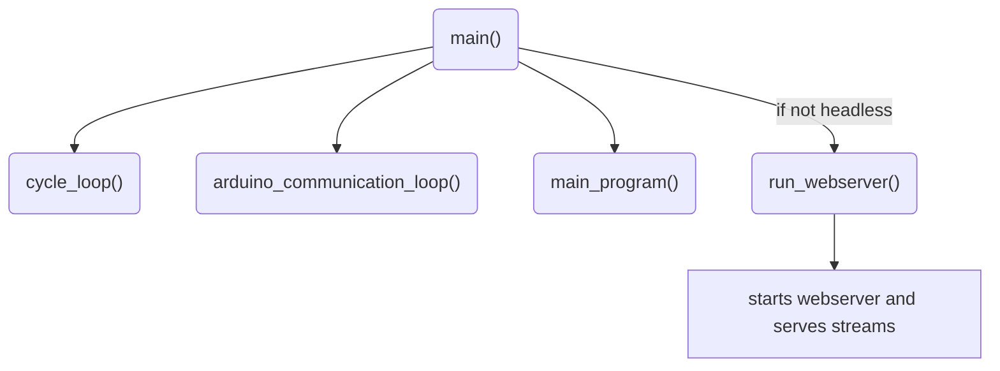

To coordinate between the asynchronous loops, the system uses two main classes:

- `Car`, which describes the instantaneous state of the vehicle, and

- `SharedState`, which holds all shared data, flags, and vision results.

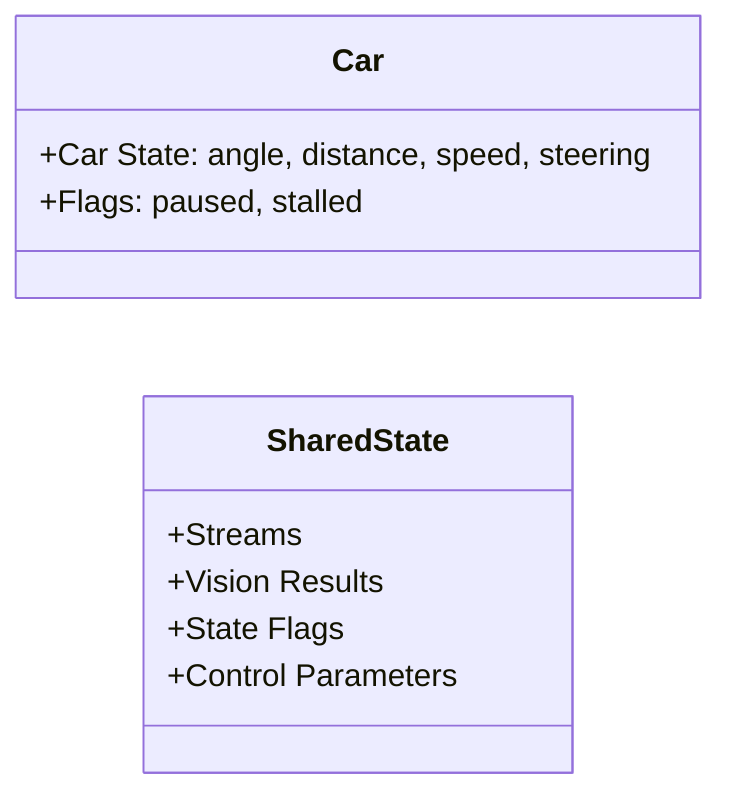

The `run_webserver()` function starts a web server that serves camera streams and robot telemetry. This loop runs only if the program is not in headless mode.

The `cycle_loop()` handles image acquisition and processing. It continuously captures frames from the camera, applies filtering (extracting red, green and pink stream using hsv and then [Thresholding](https://docs.opencv.org/4.x/d7/d4d/tutorial_py_thresholding.html)), and detects edges using [Canny Edge detection](https://docs.opencv.org/4.x/da/d22/tutorial_py_canny.html). If headless mode is off, the processed frames are visualized in real time.

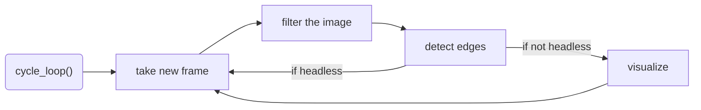

The `arduino_communication_loop()` manages low-level communication with the Arduino. It waits for the Arduino to connect via serial, sends speed and steering commands, and receives angle and distance readings. The loop continuously updates the `Car` class with the latest sensor data.

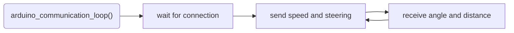

To communicate with the Arduino, we use the `pyserial` library. The Arduino is programmed to receive speed and steering commands via serial communication and send back angle and distance measurements. The communication protocol is simple: the Raspberry Pi sends a formatted string containing speed and steering values, and the Arduino responds with a formatted string containing angle and distance readings.

The `main_program()` controls the high-level challenge logic. It waits for the Arduino to connect and for the start switch to be enabled. Once started, it decides whether to execute open challenge logic or obstacle challenge logic based on the challenge type given as flag.

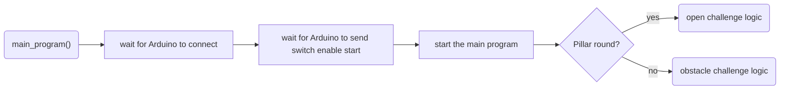

### Opening Race


We begin by determining the `round direction`. First, we crop the top half of the image and filter out all black pixels using OpenCV's [`cv2.inRange`](https://docs.opencv.org/4.x/da/d97/tutorial_threshold_inRange.html) function. On this Boolean map of black pixels, we detect edges using [`cv2.Canny`](https://docs.opencv.org/4.x/da/d22/tutorial_py_canny.html). By applying `np.argmax`, we find the heights of the walls in pixels at each x-coordinate in the image. The discrete differences between these heights are calculated using `np.diff`, raised to the fourth power, and summed up. This helps us identify the jump in wall height when the inner wall first appears.

For driving, we employ a PD-Controller in `pd_middle`. The input is derived from the black portion of a region-of-interest extracted from the outer edges of the black-and-white Boolean image. This is compared to a pre-calibrated fixed portion. We follow only the outer wall to avoid collisions with the inner walls, especially if their gap distance is randomized to be small.


The red outlines show the region of interest (ROI) used for wall detection.

Using a small ROI in the center of the camera feed (green rectangle), we detect the blue and orange lines on the game mat. The color image is converted to HSV for this purpose. Upon encountering such a line, depending on its color, we initiate a turn and decrement the remaining corners counter, allowing us to accurately stop at the end of the round.


The decimal numbers in the green rectangle show the percentage of orange and blue pixels.

---

### Obstacle Race

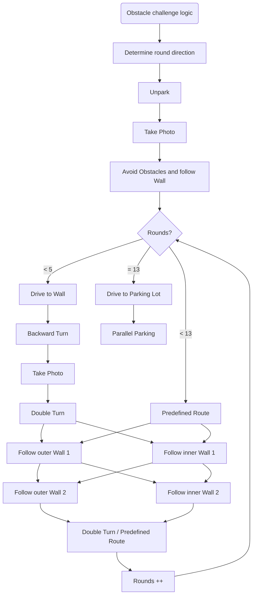

First we determine the `round direction` based on how much black we see on each side in the blue ROI.

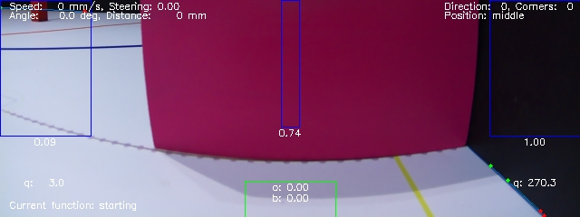

Then we `unpark` by performing a turning sequence. Before starting to drive the rounds we evaluate the current image for pillars and decide whether we have to avoid a pillar. The robot continues driving until it is near to the wall. Then it takes a backward turn to realign itself and starts driving again. After taking another picture we evaluate the pillars again.

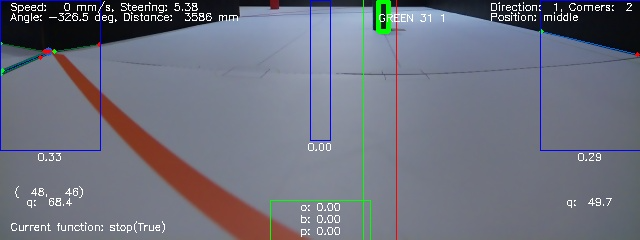

If there are pillars, it performs a double turn to avoid the pillars and then continues following the correct wall. If there are two pillars, the robot will change side in the middle of the section. After another double turn we increment the rounds counter


After completing 5 rounds, the robot follows predefined routes for each round. After completing 13 rounds, the robot drives to the parking lot and performs parallel parking.

#### Colour Detection

In addition to extracting a black-and-white image, we convert the cropped color image to HSV. This conversion allows us to more easily and robustly extract red and green pixels. We then use [`cv2.Canny`](https://docs.opencv.org/4.x/da/d22/tutorial_py_canny.html) and [`cv2.findContours`](https://docs.opencv.org/3.4/d4/d73/tutorial_py_contours_begin.html) to search for contours in this image. The centroids of the contours are extracted and stored along with their width and height.

When handling the HSV color space, special care is needed for colors near the red hue due to the wrap-around effect. The hue value for red is around 0° and 360°, meaning it wraps around the HSV color wheel. To accurately detect red, we create two separate masks: one for the lower range (e.g., 0° to 10°) and another for the upper range (e.g., 350° to 360°). These masks are then combined to form a single mask that accurately captures all red hues. This approach ensures that all shades of red are detected, avoiding issues caused by the hue value wrapping around the color wheel.


In the image above you can see the robot detecting the green pillars with the mask. It's the mask from the other [visualization](media/Pillars.png). After processing the image, the program returns a list of found pillars, sorted by their distance to the robot. The robot then drives towards the closest pillar, until it is close enough to the pillar to avoid it. The robot then drives around the pillar and continues to the next one. You can also see the center ROI used for detecting turn marking lines.

#### Wall Following

We follow the walls using the point-slope-form of the border line between the black wall and the white mat. This is again extracted using [`cv2.Canny`](https://docs.opencv.org/4.x/da/d22/tutorial_py_canny.html). We use the PD controller to keep the y-intercept of the lines on a constant height. By including the gyro values quadratically in the steering calculation, we can further stabilise the driving so that the robot does not take a U-turn. Furthermore there is a corner detection algorithm that switches the wall following to gyro corrected driving, when passing the end of the walls. In the following image you can see the corner being detected on the left ROI where two red ends of detected edges meet.

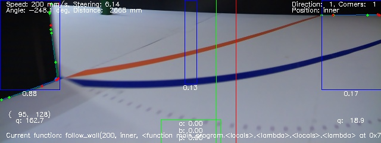

---

### Firmware Running on the Arduino

The Arduino interfaces directly with the DC motor, servo, gyro sensor, switches, and status LED. Its primary role is to exchange sensor data and control commands between these peripherals and the Raspberry Pi. To support this, we implemented a custom firmware tailored to the robot’s needs.

The high-level program flow is illustrated below:

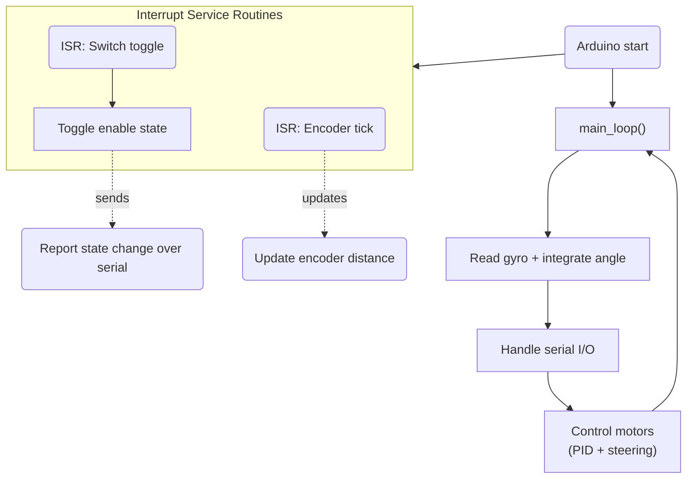

#### Overview of custom Firmware Operation

At startup, the Arduino initializes the serial connection, configures motor and servo pins, and attaches interrupt handlers for the encoder signals and the enable switch.
When the enable switch changes state, the corresponding interrupt fires and the new state is immediately sent to the Raspberry Pi.

The **main loop** performs four continuous tasks:

1. **Gyro reading and angle integration**
   The Arduino reads the angular velocity from the gyro and integrates it to estimate the robot’s heading. A custom temperature compensation model is applied to increase accuracy.

2. **Serial communication**
   The current heading and encoder-based distance are sent to the Raspberry Pi.
   At the same time, the Arduino receives speed and steering commands from the Pi.

3. **Motor and steering control**

   - The servo angle is set directly.
   - The DC motor speed is regulated using a PID controller, which keeps the velocity stable even under load.
     The PID feedback signal is derived from the encoder distance change over time.

4. **Safety and diagnostics**
   The firmware monitors conditions that indicate mechanical issues:

   - **Stall detection:**
     If the encoder shows almost no movement while the PID demands maximum PWM, the robot is considered stalled.
     In this case, the motor is shut down to prevent overheating, and an error message is sent to the Raspberry Pi.
   - **Current sensing:**
     The MC33926 motor driver provides analog current feedback.
     Although this feature is not highly reliable for small motors, it acts as an additional emergency-level safeguard.

Together, these systems ensure that the Arduino can reliably control the robot’s drivetrain, report accurate sensor data, and react quickly to unsafe conditions.

#### System-Level Interaction Diagram

The diagram below shows how the Raspberry Pi loops interact with the Arduino firmware. The Pi runs asynchronous loops for image processing, main logic, Arduino communication, and optionally a webserver.

**SharedState** and **Car** coordinate sensor readings, vision results, and control flags. The Arduino handles low-level motor/servo control, reads gyro and encoder data, executes PID control, and sends feedback over serial. Commands and feedback form a closed control loop between the Pi and Arduino.

This diagram summarizes how high-level logic, vision, and low-level control work together to navigate obstacles.

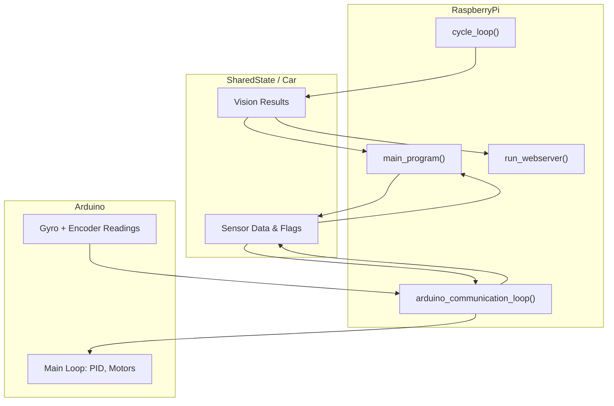

---

## Own platform for Streams

We created our own HTML file to display the camera image. This is used to send three streams constantly to our connected device in preparation mode. During the competition, we disable the communication so that the Raspberry Pi can use all its computational resources for the run. Using the streams limits the performance of the robot as much time is spent on sending the streams. Therefore, we disable it.
With our HTML file, we can also read out the color values of the environment and send these changes directly to the robot. We can change the different streams via websocket and thus display images with different filters on them.

|  |  |
|-----------------------------|-----------------------------|

---

<!-- Pictures of the team and robot must be provided. The pictures of the robot must cover all sides of the robot, must be clear, in focus and show aspects of the mobility, power and sense, and obstacle management. Reference in the discussion sections 1, 2 and 3 can be made to these pictures. Team photo is necessary for judges to relate and identify the team during the local and international competitions. -->

## Photos

|  |  |
|---------------------------------|---------------------------------|
|  |  |
|  |  |
|  |  |
|  |  |


|  | |
|----------------------------------------|---------------------------------------|

**The national menu of Switzerland is fondue. While usually fondue is made from cheese, the team is enjoying a robot fondue 😎🤪**

<!-- The performance videos must demonstrate the performance of the vehicle from start to finish for each challenge. The videos could include an overlay of commentary, titles or animations. The video could also include aspects of section 1, 2 or 3 -->

## Videos

<!-- https://michaelcurrin.github.io/badge-generator/#/generic -->

[](https://youtu.be/OofLgNROook)

[](https://youtu.be/P_mGKfEbACU)

---

## Enabling Reproducibility

To enable the reproduction of our robot, we provide the following installation instructions:

1. Install Raspberry Pi OS on your Raspberry Pi using the [official guide](https://www.raspberrypi.org/documentation/installation/installing-images/README.md) While the os is installing, you can flash the Arduino code to the Arduino Nano. The Arduino code can be found in the [src](/src) folder. The code can be uploaded using [PlatformIO](https://docs.platformio.org/en/latest/integration/ide/vscode.html).
2. After booting up the Raspberry Pi, connect via [ssh](https://www.raspberrypi.com/documentation/computers/remote-access.html#ssh). Enable the camera with `sudo raspi-config` and the following commands. Then reboot for the changes to take effect.

    ```txt
    Interface Options  →  Legacy Camera  →  Disable (important!)
    Interface Options  →  CSI Camera     →  Enable
    ```

3. Install the following packages:

    ```bash
    sudo apt-get update
    sudo apt-get install python3-opencv python3-websockets python3-numpy python3-pyserial python3-picamera2
    ```

4. Clone the repository and run the main script:

    ```bash
    git clone https://github.com/flawil-beavers/Future-Engineers_2025.git
    ```

5. Running the robot in dev mode

    Check in the config file, if the correct usb port is set for the Arduino. Check the correct port with `ls /dev/tty*` and look for the port that is connected to the Arduino. Change the port in the config file to the correct port.

    Navigate to the `raspberry_pi` directory and run the main script:

    ```bash
    cd Future-Engineers_2025/raspberry_pi
    python3 main.py
    ```

    To launch the robot, switch the start button to the start position. The robot will now start driving autonomously. If you want to watch the live stream just open the web interface in your browser and click the connect button. To pause and resume the robot, you can press the stop button on the robot. By pressing `ctrl+c` multiple times in the ssh session you can stop the robot.

6. Next steps

    - To make the program executable run the following commands in the `raspberry_pi` folder:

        ```bash
        chmod +x main.py
        ```

        Now you can start the robot using `./main.py` when in the `raspberry_pi` folder.

    - Run [`setup_ssh.bat`](other/setup_ssh.bat) to configure your device to connect to the Raspberry Pi via ssh without password.
    - Try out the different flags:

        ```bash
        python3 main.py --headless  # Run in headless mode without web interface
        python3 main.py --pillars   # Run in pillar mode
        python3 main.py --shutdown  # Shutdown after run
        python3 main.py --calibrate # Disable driving and moving to next states
        python3 main.py --skip-arduino # Skip Arduino connection
        ```

## Future Improvements

**Mechanical Improvements**

- Build a robot capable of steering tighter curves, enabling easier parallel parking.
- Redesign the connection between the back and front steering axes to reduce slack.
- Consider using fully 3D-printed parts for the steering assembly to further minimize play.
- Incorporate bearings to drive and steer the axles more smoothly.
- Remake the custom metal steering rod to ensure proper alignment, so front and back axles steer equally. In our current version they aren't aligned properly.

**Electronics & Sensors**

- Use a more advanced gyro that integrates angular acceleration automatically. E.g. [BNO085](https://www.adafruit.com/product/4754)
- Develop a custom PCB for all electronics to simplify assembly; current components fit well but a PCB would streamline the setup and reduce errors due to dry solder joints
- Include a BMU to monitor the battery voltage, alert the user when it needs replacing, and safely shut down the robot. Currently, we have to change the battery every hour to prevent deep discharge.

**Software Improvements**

- Increase the main loop speed, potentially switching to C++, to improve overall responsiveness.
- Adjust PD controllers to account for variable loop times, ensuring the derivative term reflects actual time intervals.
- Improve color filtering to handle challenging lighting conditions, such as warm indoor light, outdoor reflections, or poorly lit pillars. This caused some problems while training in our cellar.

<!-- $env:MERMAID_BIN="C:\Users\philk\AppData\Roaming\npm\mmdc.cmd"
pandoc README.md -o README.pdf --pdf-engine=xelatex -V mainfont="Segoe UI Emoji" --filter pandoc-mermaid -->
