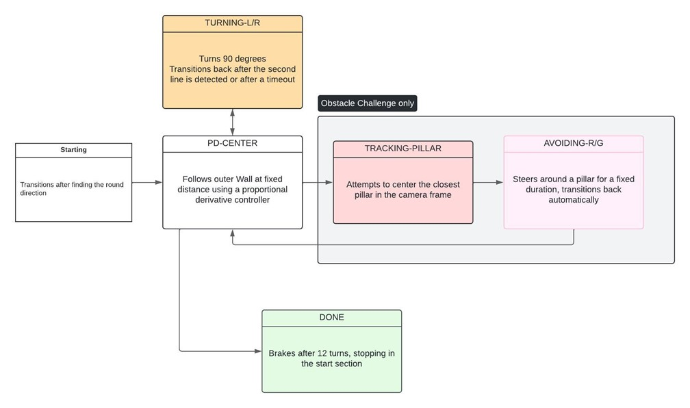
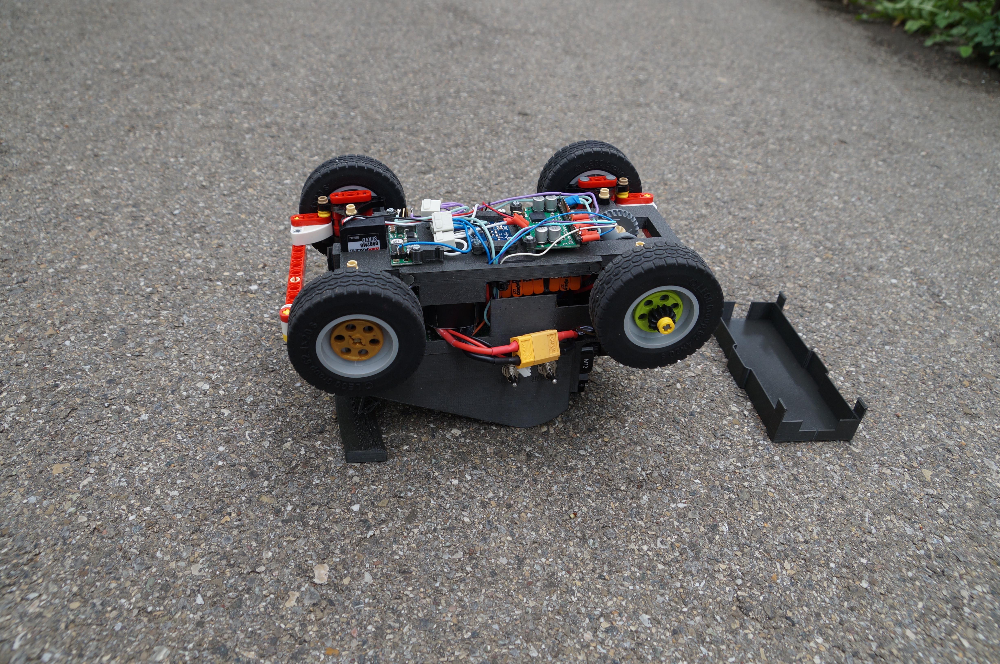
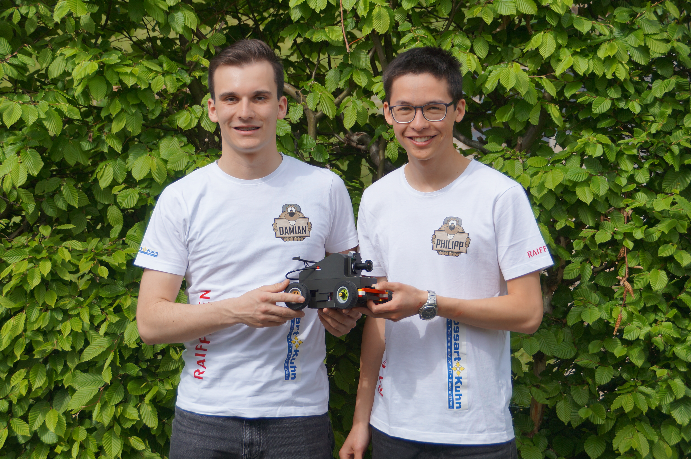

# Flawil Beavers
## Future-Engineers_2025


[](https://youtu.be/AOWf1q8zvfM)


**This is the GitHub repository for team FlawilBeavers for WRO 2025. You'll find our documentation in this README.**

---

## Contents

- [Mobility and Hardware Design](#mobility-management)
- [Power and Sense Management](#power-and-sense-management)
  - [Power Management](#power-management)
  - [Sense Management](#sense-management)
  - [Wiring Diagram](#wiring-diagram)
  - [Bill of Materials](#bill-of-materials)
- [Obstacle Management](#obstacle-management)
- [Photos](#photos)
- [Videos](#videos)
- [Enabling Reproducibility](#enabling-reproducibility)

---

## Introduction

We, Damian Hardegger and Philipp Kündig, make up the WRO team Flawil Beavers. We've been participating in WRO competitions since 2019. Previously, we competed in the RoboMission category and were successful there. But last year, we took on a new challenge and ventured into the Future Engineers category. There, too, we were able to gain our first experiences and even win the Open Championships in Italy.

---

<!-- Mobility management discussion should cover how the vehicle movements are managed. What motors are selected, how they are selected and implemented.
A brief discussion regarding the vehicle chassis design /selection can be provided as well as the mounting of all components to the vehicle chassis/structure. The discussion may include engineering principles such as speed, torque, power etc. usage. Building or assembly instructions can be provided together with 3D CAD files to 3D print parts. -->

## Mobility Management

The robot is made entirely from 3D printed parts, except for the axles with wheels and gears, which are made from Lego parts because they give us more flexibility. We embedded the individ-ual electronic components in our 3D print. Our robot has a double Ackerman steering mecha-nism for both axes, so that the robot can easily make tight turns. To distribute the torque evenly, we integrated a differential into the front axle to drive the two front wheels.
We connected the motors to the chassis using 3D-printed couplings that connect the motor shaft directly to a Lego axle, so that a single DC motor can drive the entire robot. The motor is positioned as low as possible to achieve a stable structure with a low centre of gravity. We opted for a 12 V, 220 rpm motor with a gear ratio of 150:1, which, despite its modest speed, is ideal for the robot due to its high torque of 1.8 kg*cm at a quiescent current of 0.75 A. This small motor ensures smooth driving and acceleration. An RC servo motor with a holding torque of 1.9 kg*cm is used for the steering, which is connected to the steering axis via a 3D-printed coupling and Lego gears. As the DC motor prevents the front and rear axles from being directly connected for simultaneous steering, we have extended the linkage above the motor and placed the servo mo-tor underneath that linkage.


We have designed and printed additional parts for the remaining electronics. The camera mount is designed so that the camera can be easily inserted from above. The other electronics are mounted on a plate above the robot or, for space reasons, on the underside of the robot. These parts are screwed to the remaining 3D printed parts. We used standard M3 or M2.5 hardware to assemble the 3D printed components and attach the electronics. The parts were designed so that the nuts could be pressed in during printing without support structures, allowing for a strong and reliable connection. Depending on accessibility, we used either square or hexagonal nuts for assembly.


The battery is mounted as low as possible again to keep the centre of gravity as low as possible. We used a magnet mount to ensure that we can change the battery easily.

---

<!-- Power and Sense management discussion should cover the power source for the vehicle as well as the sensors required to provide the vehicle with information to negotiate the different challenges. The discussion can include the reasons for selecting various sensors and how they are being used on the vehicle together with power consumption. The discussion could include a wiring diagram with BOM for the vehicle that includes all aspects of professional wiring diagrams. -->

## Power and Sense Management

### Power Management

We use a standard 4S LiPo battery as a power source. This flexible yet commercially available solution enables us to operate our drive and computer vision subsystems with just one DC-DC step-down converter. The 14.8 V from the battery is fed directly into the H-bridge motor driver, an L298N variant. The step-down converter supplies a stable 5V to the main on-board computer, a Raspberry Pi 4B. Our computer vision algorithms run on this low-power yet powerful SBC. The 5V is also routed to an Arduino Nano, which is connected serially to the Raspberry via USB - this serves to separate the image processing from the motor control. Acceleration, PWM modulation etc. are handled by the Nano.
Most thought has been given to power consumption, as the Raspberry Pi consumes up to 1.2 amps. The servo motor can draw up to 0.6 A at standstill. The DC-DC converter had to be select-ed to fulfil these criteria. The drive motor is supplied separately, but still only draws 0.75 A. Thanks to this separation, nothing had to be specified for high currents. 
The H-bridge allows the Arduino Nano to control the Motor with 3 pins: 2 for selecting the direc-tion of rotation and one for controlling the speed using PWM (pulse width modulation). With this component, the 12-volt system can be safely controlled with the Raspberry Pis and Arduino 5 volts.


---

### Sense Management

Last year, we tried out various sensors, such as ultrasonic sensors, gyroscopic sensors and cameras. After using the camera, we realised that the camera is sufficient if the field of view is large enough. That's why we opted for a Pi HQ camera with a lens that has a field of view of 120°. 
The camera enables the robot to get an accurate picture of the objects around it.
The Pi HQ camera is connected directly to the Raspberry Pi and is therefore powered directly by the Pi. The Pi, on the other hand, receives its power via the 5V pins on the GPIO connector.
After our experiences last year, we decided to leave out all ultrasonic sensors and the gyro-scope. Instead of relying on hardware sensors, we opted for more processing of the video to emulate distance sensors. To simplify the processing and make it easier to detect walls, we placed the camera exactly 100 mm above the floor so that its centre line is exactly level with the top of the wall. 
We are now also working with a gyro sensor that monitors the robot's movements, enabling it to make more precise turns and maintain the line of travel.


---

## Wiring Diagram


---

## Bill of Materials

| **Amount** | **Product**                                                                 | **Price (CHF)** |
|------------|-----------------------------------------------------------------------------|-----------------|
| 1          | Raspberry Pi M12 HQ Camera                                                 | 45.34           |
| 1          | EDATEC 12MP 3.2mm M12 Raspberry                                            | 28.84           |
| 1          | Raspberry Pi 4 Model B 8GB                                                | 79.00           |
| 1          | Arduino Nano: Multifunktionales Board ATmega328 16Mhz, Mini-USB            | 19.95           |
| 1          | Tattu LiPo-Akku 14.8V 850mAh 95C 4S1P RL                                   | 14.00           |
| 1          | L298N Schrittmotorendstufe / H-Brücke / DC Motor Treiber                   | 8.90            |
| 1          | Amewi 0902MG Micro Servo                                                  | 14.40           |
| 1          | IMU 9-Axis L3GD20, LSM303D [H07]                                          | 6.10            |
| 1          | 150:1 Micro Metal Gearmotor HPCB 12V with 12 CPR Encoder, Side Connector  | 29.64           |
| ~20        | M2.5 Screws and Nuts                                                      | 2.00            |
| ~10        | M2 Screws and Nuts                                                        | 1.00            |
| ~300g      | 3D Printing Filament                                                      | 5.00            |
| ~20        | Jumper Cables                                                             | 4.00            |
| A Few      | LEGO Technic Bricks                                                       | -               |
| 4          | LEGO Technic Wheels                                                       | -               |
| **TOTAL**  |                                                                             | **258.17**      |

All files for the 3D printed parts can be found in the 3D-Printed-Parts folder on GitHub. All parts can be printed without supports at 0.2mm layer height. We recommend using PET-G or nGen for the parts (PLA can also be used). The wiring diagram can be found in the Wiring Diagram file. The instructions for the LEGO chassis can be found in the stud.io file.

---

## Obstacle Management

### Opening Race


The robot's behavior is modeled using a behavior tree. The [StateMachine](/raspy/statemachine.py) class manages the current state and handles transitions to new states. States can also be scheduled to start in the future, which is useful for delaying turns to avoid hitting inner walls. In the opening race, we use the states “STARTING,” “PD-CENTER,” “TURNING-L/R,” and “DONE.”

We begin by determining the round direction. First, we crop the top half of the image and filter out all black pixels using OpenCV's `cv2.inRange` function. On this Boolean map of black pixels, we detect edges using `cv2.Canny`. By applying `np.argmax`, we find the heights of the walls in pixels at each x-coordinate in the image. The discrete differences between these heights are calculated using `np.diff`, raised to the fourth power, and summed up. This helps us identify the jump in wall height when the inner wall first appears.

For driving, we employ a PD-Controller. The input is derived from the black portion of a region-of-interest extracted from the outer edges of the black-and-white Boolean image. This is compared to a pre-calibrated fixed portion. We follow only the outer wall to avoid collisions with the inner walls, especially if their gap distance is randomized to be small.

Using a small region of interest in the center of the camera feed, we detect the blue and orange lines on the game mat. The color image is converted to HSV for this purpose. Upon encountering such a line, depending on its color, we initiate a turn and decrement the remaining corners counter, allowing us to accurately stop at the end of the round.


The red outlines show the region of interest used for wall detection.


---

### Obstacle Race

In addition to extracting a black-and-white image, we convert the cropped color image to HSV. This conversion allows us to more easily and robustly extract red and green pixels. We then use `cv2.Canny` and `cv2.findContours` to search for contours in this image. The centroids of the contours are extracted and stored along with their width and height. The behavior tree is updated with two new states: "TRACKING-PILLAR" and "AVOIDING-PILLAR-R/G".

When handling the HSV color space, special care is needed for colors near the red hue due to the wrap-around effect. The hue value for red is around 0° and 360°, meaning it wraps around the HSV color wheel. To accurately detect red, we create two separate masks: one for the lower range (e.g., 0° to 10°) and another for the upper range (e.g., 350° to 360°). These masks are then combined to form a single mask that accurately captures all red hues. This approach ensures that all shades of red are detected, avoiding issues caused by the hue value wrapping around the color wheel.

.jpeg>)

In the image above you can see the robot detecting the red and green pillars. After processing the image, the program returns a list of found pillars, sorted by their distance to the robot. The robot then drives towards the closest pillar, until it is close enough to the pillar to avoid it. The robot then drives around the pillar and continues to the next one. You can also see the center ROI used for detecting turn marking lines.




---

## Own platform for streams
We created our own HTML file to display the camera image. This is used to send three streams constantly to our connected device in preparation mode. During the competition, we disable the communication so that the raspberry can use all its computational resources for the run. Using the streams limits the performance of the robot as much time of the loop is spent on sending the streams. Therefore, we disable it.
With our HTML file, we can also read out the color values of the environment and send these changes directly to the robot. We can change the different streams via websocket and thus dis-play images with different filters on them.


|  |  |
|-----------------------------|-----------------------------|


---
<!-- Pictures of the team and robot must be provided. The pictures of the robot must cover all sides of the robot, must be clear, in focus and show aspects of the mobility, power and sense, and obstacle management. Reference in the discussion sections 1, 2 and 3 can be made to these pictures. Team photo is necessary for judges to relate and identify the team during the local and international competitions. -->

## Photos






---

## Videos
<!-- The performance videos must demonstrate the performance of the vehicle from start to finish for each challenge. The videos could include an overlay of commentary, titles or animations. The video could also include aspects of section 1, 2 or 3 -->

[](https://youtu.be/AOWf1q8zvfM)

---

## Enabling Reproducibility

To enable the reproduction of our robot, we provide the following installation instructions:

1. Install rapsberry pi os on your raspberry pi using the [official guide](https://www.raspberrypi.org/documentation/installation/installing-images/README.md) While the os is installing, you can falsh the arduino code to the arduino nano. The arduino code can be found in the [arduino](/arduino/OutputProxy) folder. The code can be uploaded using platformIO.
2. After booting up the raspberry pi, connect via ssh, and install the following packages:

```bash
sudo apt-get update
sudo apt-get install python3-opencv python3-websockets python3-numpy python3-pyserial
```

3. Enable the camera using `sudo raspi-config` and reboot the raspberry pi for the changes to take effect. Install the corresponding python module:

```bash
sudo apt-get installpython3-picamera2
```

4. Clone the repository and run the main script:

```bash
git clone https://github.com/robofactory-ch/flawfactory-future-engineers-brescia.git
```

5. Running the robot in dev mode

Check in the config file, if the correct usb port is set for the arduino. Check the correct port with `ls /dev/tty*` and look for the port that is connected to the arduino. Change the port in the config file to the correct port.

Make sure pillars are enabled/disabled in the config file, and that no fixed round direction is set.

Navigate to the `raspy` directory and run the main script:

```bash
cd flawfactory-future-engineers-brescia/raspy
python3 roi.py
```

To launch the robot, open the web interface in your browser and start the robot by clicking the connect button. The robot will now start driving autonomously. To stop the robot, you can close the web interface, press the stop button on the robot or press `ctrl+c` in the ssh session.


