# Flawil Beavers

## Future-Engineers_2025


| Opening Challenge | Obstacle Challenge |
|--------------|---------------|
| [](https://youtu.be/OofLgNROook) | [](https://youtu.be/P_mGKfEbACU) |
| [](https://youtu.be/OofLgNROook) | [](https://youtu.be/P_mGKfEbACU) |

**This is the GitHub repository for team Flawil Beavers for WRO 2025. You'll find our documentation in this README.**

---

## Contents

- [Mobility and Hardware Design](#mobility-management)
- [Power and Sense Management](#power-and-sense-management)
  - [Power Management](#power-management)
  - [Sense Management](#sense-management)
  - [Wiring Diagram](#wiring-diagram)
  - [Bill of Materials](#bill-of-materials)
- [Obstacle Management](#obstacle-management)
- [Photos](#photos)
- [Videos](#videos)
- [Enabling Reproducibility](#enabling-reproducibility)

---

## Introduction

We, Damian Hardegger and Philipp Kündig, make up the WRO team Flawil Beavers. We've been participating in WRO competitions since 2019. Previously, we competed in the RoboMission category and were successful there. But last year, we took on a new challenge and ventured into the Future Engineers category. There, too, we were able to gain our first experiences and even win the Open Championships in Italy.

---

# **Assembly Instructions**

---

<details><summary><span style="font-size:1.4em; font-weight:700;">Step 1 – Preparations</span></summary>

Gather all required materials according to the [**Bill of Materials (BOM)**](#bill-of-materials) and print all necessary **[3D‑Printed‑Parts / CAD & STL](./CAD/Seperate%20Parts/)**.  
Use **M3 screws** for all mechanical components, and **M2 screws** for electronic parts.

> ⚠️ **Note:**  
> For the **base plate** and **battery cover**, **magnets must be inserted during the printing process**.  
> Make sure to place them in time before the printer closes the respective layers.

</details>

---

<details><summary><span style="font-size:1.4em; font-weight:700;">Step 2 – Base Plate and Drive Assembly</span></summary>

Take the printed **[base plate](./CAD/Seperate%20Parts/Base.3mf)** and begin by mounting the two **motors**.  
The **drive motor** is positioned in the center and secured with [DC motor cover](./CAD/Seperate%20Parts/DC%20motor%20cover.3mf).  
Place a **coupling** between the motor shaft and the **LEGO axle** – we recommend a **metal coupling**, though [Shaft](./CAD/Seperate%20Parts/Shaft.3mf) can also be used.

Next, install the [Gearbox back](./CAD/Seperate%20Parts/Gearbox%20back.3mf) as well as the [Gerbox front](./CAD/Seperate%20Parts/Gerbox%20front.3mf) and [Gearbox front inset](./CAD/Seperate%20Parts/Gearbox%20front%20inset.3mf) on the base plate.  
Attach the **servo motor** using [Servo shaft](./CAD/Seperate%20Parts/Servo%20shaft.3mf) + [Servo shaft lego](./CAD/Seperate%20Parts/Servo%20shaft%20lego.3mf) and ensure all fasteners are tight.

Route the **motor cables to the side**, so they remain accessible later.  
Finally, verify that **all shafts are properly aligned and firmly fastened**.

|<br> **Base plate**|  <br> **DC motor cover** |  <br> **Shaft** |
|---|---|---|
| <br> **Gearbox back**|  <br> **Gerbox front** |  <br> **Gearbox front inset** |

 <br> **Servo shaft** | <br> **Servo shaft lego** |
|---|---|

</details>

---

<details><summary><span style="font-size:1.4em; font-weight:700;">Step 3 – LEGO Component Assembly</span></summary>

Attach the **LEGO components** to the 3D-printed parts as shown below.

**[LEGO Assembly](CAD/Lego_Chassis.io)**
<br>
<br>

<p align="center">
    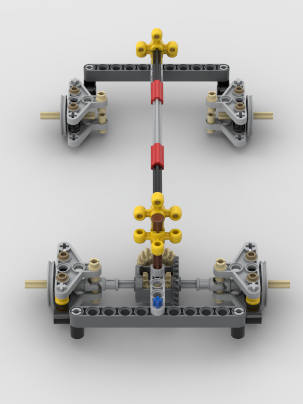
    <br>
    <strong>LEGO Chassis</strong>
</p>

Ensure all connections fit snugly and that no parts are misaligned.

</details>

---

<details><summary><span style="font-size:1.4em; font-weight:700;">Step 4 – Steering axel</span></summary>

Check that you have installed both **gearboxes (step 2)** onto the base plate, then complete the **steering shaft assembly**.  
A **metal rod** is recommended; alternatively, a **16 cm LEGO steering bar** can be used.

These components secure all shafts in place and ensure stable **gear engagement**.  
Verify that all gears rotate smoothly and are properly meshed.

</details>

---

<details><summary><span style="font-size:1.4em; font-weight:700;">Step 5 – Computer Mounting Plate</span></summary>

Attach [Raspberry holder](./CAD/Seperate%20Parts/Rasbperry%20holder.3mf), the **mounting plate for the Raspberry Pi and the [cover top lower](./CAD/Seperate%20Parts/Cover%20top%20lower.3mf)**, to the supports installed in the previous step.  
Then, mount the [Camera mount](./CAD/Seperate%20Parts/Camera%20mount.3mf) on top of this plate as shown in the image.

**[complete vehicle model](./CAD/Car%20v87.step)**

|  <br> **Raspberry holder** |  <br> **cover top lower** |  <br> **Camera mount** |
|---|---|---|

<br>
Make sure the alignment is precise so that cables and connectors remain easily accessible.

</details>

---

<details><summary><span style="font-size:1.4em; font-weight:700;">Step 6 – Installing the Electronics</span></summary>

Mount the **Raspberry Pi** onto the upper plate.  
The **Arduino Nano** will be connected later and should remain **temporarily unattached** for now.

Carefully turn the robot upside down and install the remaining **electrical components** on the underside, following the reference picture.

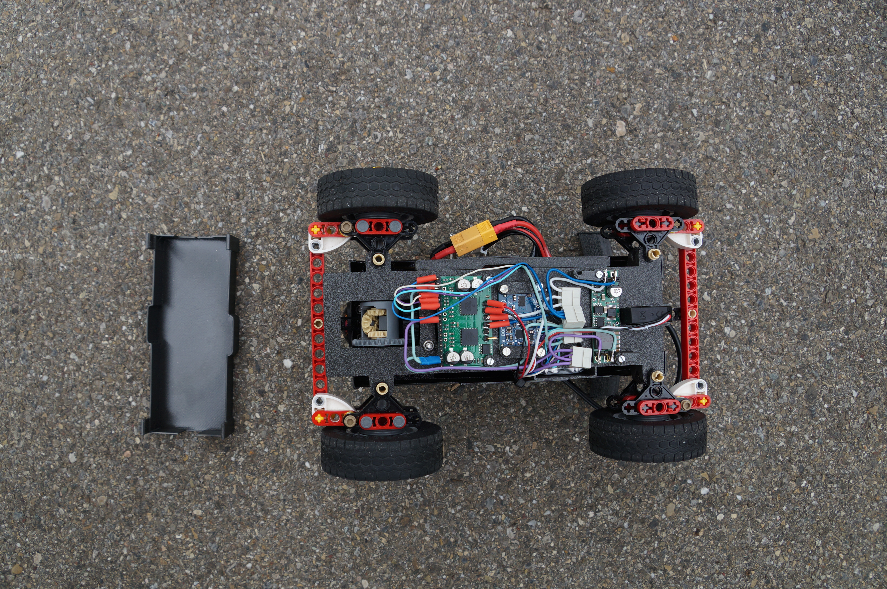

Use the washers and fastening materials:

|  <br> **[Voltager regulator](./CAD/Seperate%20Parts/Voltager%20regulator%20spacer%20top.3mf)**| <br> **[Motor driver](./CAD/Seperate%20Parts/Motor%20driver%20spacer%20top.3mf)** | <br> **[Gyro spacer](./CAD/Seperate%20Parts/Gyro%20spacer.3mf)**|
|---|---|---|

> 💡 **Tip:**  
> Use **nylon washers or plastic spacers** under PCBs to prevent short circuits.

</details>

---

<details><summary><span style="font-size:1.4em; font-weight:700;">Step 7 – Wiring</span></summary>

Follow the provided **[Wiring Diagram](#wiring-diagram)** to correctly interconnect all components.  
The **Arduino Nano** can temporarily remain on the top side for easy access.

Solder the wires of the power components on the underside and use **connectors** where possible to simplify maintenance.  
For the main power supply, **WAGO terminals** can be placed in the front interior compartment of the robot.

> ⚠️ **Warning:**  
> Double-check **all GND and power connections**.  
> Incorrect wiring may damage components or even cause **short circuits and fire hazards**.

</details>

---

<details><summary><span style="font-size:1.4em; font-weight:700;">Step 8 – Enclosure Assembly</span></summary>

Place [Bottom cover](./CAD/Seperate%20Parts/Bottom%20cover.3mf) over the wiring from underneath – it should **snap into place securely**.  
Then, flip the robot back upright and prepare the [top cover](./CAD/Seperate%20Parts/Cover%20top%20upper.3mf).

Mount the **toggle switches** and the **status LED** as shown, and connect them directly to the Arduino.

Before fully closing the housing:

1. Connect the **camera module** and route the ribbon cable through the opening.  
2. Link the **Arduino Nano** to the **Raspberry Pi** using a **USB-A to Micro-USB cable**.  
3. Once completed, install and fasten the housing completely.

|  <br> **Bottom cover** |  <br> **Top cover** |
|---|---|

</details>

---

<details><summary><span style="font-size:1.4em; font-weight:700;">Step 9 – Hardware Finalization</span></summary>

Mount the **camera** at the front of the robot.  
Carefully attach the **lens**, making sure it is free of dust and properly focused.  
Tighten it fully to prevent image blur caused by vibration.

To finish:

- Install the [rear spoiler](./CAD/Seperate%20Parts/spoiler_full_2.3mf) (for that extra aerodynamic performance 😎).
- Don't forget to install the [Battery holder](./CAD/Seperate%20Parts/Battery%20holder.3mf).
- Attach the **wheels**.

Your robot’s **hardware assembly** is now complete and ready for operation.

|  <br> **rear spoiler 😎** |  <br> **Battery holder** |
|---|---|

</details>

---

<details><summary><span style="font-size:1.4em; font-weight:700;">Step 10 – Software Installation and Setup</span></summary>

Carefully read through the **[software documentation](#enabling-reproducibility)** and install all required software packages on the **Raspberry Pi** and **Arduino Nano**.  
Upload the corresponding **firmware, scripts, and configuration files** as described in the software section.

> **Congratulations!**  
> Your robot is now fully assembled and ready for its first run.  
> Enjoy driving, experimenting, and improving your creation!

</details>

---

<!-- Mobility management discussion should cover how the vehicle movements are managed. What motors are selected, how they are selected and implemented.
A brief discussion regarding the vehicle chassis design /selection can be provided as well as the mounting of all components to the vehicle chassis/structure. The discussion may include engineering principles such as speed, torque, power etc. usage. Building or assembly instructions can be provided together with 3D CAD files to 3D print parts. -->

## Mobility Management

The robot is made entirely from 3D printed parts, except for the axles with wheels and gears, which are made from Lego parts because they give us more flexibility. Due to the wear in plastic parts we updated an axle and a coupling to metal parts. Those enable us a higher precision.
We embedded the individual electronic components in our 3D print. Our robot has a double Ackerman steering mechanism for both axes, so that the robot can easily make tight turns. To distribute the torque evenly, we integrated a differential into the front axle to drive the two front wheels.
We connected the motors to the chassis using 3D-printed couplings that connect the motor shaft directly to a Lego axle, so that a single DC motor can drive the entire robot. The motor is positioned as low as possible to achieve a stable structure with a low centre of gravity. We opted for a 12 V, 220 rpm motor with a gear ratio of 150:1, which, despite its modest speed, is ideal for the robot due to its high torque of 1.8 kg\*cm at a quiescent current of 0.75 A. This small motor ensures smooth driving and acceleration. An RC servo motor with a holding torque of 1.9 kg\*cm is used for the steering, which is connected to the steering axis via a 3D-printed coupling and Lego gears. As the DC motor prevents the front and rear axles from being directly connected for simultaneous steering, we have extended the linkage above the motor and placed the servo mo-tor underneath that linkage.


We have designed and printed additional parts for the remaining electronics. The camera mount is designed so that the camera can be easily inserted from above. The other electronics are mounted on a plate above the robot or, for space reasons, on the underside of the robot. These parts are screwed to the remaining 3D printed parts. We used standard M3 or M2.5 hardware to assemble the 3D printed components and attach the electronics. The parts were designed so that the nuts could be pressed in after printing without support structures, allowing for a strong and reliable connection. Depending on accessibility, we used either square or hexagonal nuts for assembly.


The battery is mounted as low as possible again to keep the centre of gravity as low as possible. We used a magnet mount to ensure that we can change the battery easily.

---

<!-- Power and Sense management discussion should cover the power source for the vehicle as well as the sensors required to provide the vehicle with information to negotiate the different challenges. The discussion can include the reasons for selecting various sensors and how they are being used on the vehicle together with power consumption. The discussion could include a wiring diagram with BOM for the vehicle that includes all aspects of professional wiring diagrams. -->

## Power and Sense Management

### Power Management

We use a standard 4S LiPo battery as a power source. This flexible yet commercially available solution enables us to operate our drive and computer vision subsystems with just one DC-DC step-down converter. The 14.8 V from the battery is fed directly into the H-bridge motor driver, an L298N variant. The step-down converter supplies a stable 5V to the main on-board computer, a Raspberry Pi 4B. Our computer vision algorithms run on this low-power yet powerful SBC. The 5V is also routed to an Arduino Nano, which is connected serially to the Raspberry via USB - this serves to separate the image processing from the motor control. Acceleration, PWM modulation etc. are handled by the Nano.
Most attention was given to power consumption: the Raspberry Pi alone can draw up to 1.2 A, and the servo motor requires up to 0.6 A when stalled. The DC-DC converter therefore had to be selected to safely support these loads.
The drive motor is powered separately and draws only about 0.75 A, which means that - thanks to this separation - no components had to be rated for higher combined currents.
The H-bridge allows the Arduino Nano to control the Motor with 3 pins: 2 for selecting the direction of rotation and one for controlling the speed using PWM (pulse width modulation). With this component, the 12-volt system can be safely controlled with the Raspberry Pis and Arduino 5 volts.

---

### Sense Management

Last year, we experimented with several types of sensors, including ultrasonic modules, gyroscopes, and cameras. Through testing, we found that a single camera was sufficient for navigation - provided it had a wide enough field of view. Based on this, we chose the Raspberry Pi HQ camera with a 120° lens, giving the robot a detailed, wide-angle view of its surroundings.

The camera connects directly to the Raspberry Pi and is powered through it, while the Raspberry Pi itself receives power via the 5 V pins on the GPIO header.

Following last year’s experience, we removed ultrasonic sensors from the design, instead using video processing to emulate distance sensing. To simplify image processing and improve wall detection, the camera is mounted exactly 100 mm above the floor, allowing the car to focus on the lower half of the image.

We have since introduced a gyroscope as a support tool to enabling more precise turns and improved stability while driving straight.

---

## Wiring Diagram


---

## Bill of Materials

| **Amount** | **Product**                                                               | **Price (CHF)** | **Source**      |
|------------|---------------------------------------------------------------------------|-----------------|-----------------|
| 1          | Raspberry Pi M12 HQ Camera                                                | 45.34           |[Google](https://www.raspberrypi.com/documentation/accessories/camera.html)|
| 1          | EDATEC 12MP 3.2mm M12 Raspberry                                           | 28.84           |[Google](https://edatec.cn/docs/assets/m12-lens/170320-12/ED-LENS-M12-170320-12-datasheet-en.pdf)|
| 1          | Raspberry Pi 4 Model B 8GB                                                | 79.00           |[Google](https://datasheets.raspberrypi.com/rpi4/raspberry-pi-4-datasheet.pdf)|
| 1          | Arduino Nano: Multifunktional Board ATmega328 16Mhz, Mini-USB             | 19.95           |[Google](https://store.arduino.cc/products/arduino-nano)|
| 1          | Tattu LiPo-Akku 14.8V 850mAh 95C 4S1P RL                                  | 14.00           |[Google](https://swissbatt24.ch/geraetebatterien/rc-drohnen/drohnen/4060/tattu-850mah-14-8v-4s1p-r-line-95c-lipo-akkupack-mit-xt30-stecker?srsltid=AfmBOorWBfktBLLxOzlvwCK3Ksib1zzLIcjN5n8nkZQ84-NGlXiVSCHp&utm)|
| 1          | Pololu Dual MC33926 Motor Driver Carrier                                  | 52.95           |[Google](https://www.pololu.com/product/1213)|
| 1          | Amewi 0902MG Micro Servo                                                  | 14.40           |[Google](https://www.digitec.ch/de/s1/product/amewi-digital-amx-racing-0902mg-rc-servo-12872149)|
| 1          | IMU 9-Axis L3GD20, LSM303D [H07]                                          | 6.10            |[Google](https://www.adafruit.com/product/1714)|
| 1          | 150:1 Micro Metal Gearmotor HPCB 12V with 12 CPR Encoder, Side Connector  | 29.64           |[Google](https://www.pololu.com/product/3042)|
| 2          | Changeover switch                                                         | 4.00            ||
| 1          | USB-A to USB-micro cabel 15cm                                             | 7.80            ||
| 1          | LED                                                                       | 0.50            ||
| ~20        | M2.5 Screws and Nuts                                                      | 2.00            ||
| ~10        | M2 Screws and Nuts                                                        | 1.00            ||
| ~300g      | 3D Printing Filament                                                      | 5.00            ||
| ~20        | Jumper Cables                                                             | 4.00            ||
| 8          | electrical connectors                                                     | 3.00            ||
| 1          | metal drive shaft                                                         | selfmade        ||
| 1          | motor shaft coupling                                                      | selfmade        ||
| A Few      | LEGO Technic Bricks                                                       | -               ||
| 4          | LEGO Technic Wheels                                                       | -               ||
| **TOTAL**  |                                                                           | **317.52**      |

All files for the 3D printed parts can be found in the 3D-Printed-Parts folder on GitHub. All parts can be printed without supports at 0.2mm layer height. We recommend using PET-G or nGen for the parts (PLA can also be used). The wiring diagram can be found in the Wiring Diagram file. The instructions for the LEGO chassis can be found in the stud.io file.

---

## Obstacle Management

<!-- Obstacle management discussion should include the strategy for the vehicle to negotiate the obstacle course for all the challenges. This could include flow diagrams, pseudo code and source code with detailed comments. -->

### Software Architecture

Our main program runs on python and runs asynchrounous. Thanks to the `asyncio` library, we can run multiple loops at the same time. The main components of our program are the image processing loop, the arduino communication loop, the main program loop and the webserver loop (if not in headless mode). The following flowchart illustrates how these components interact:

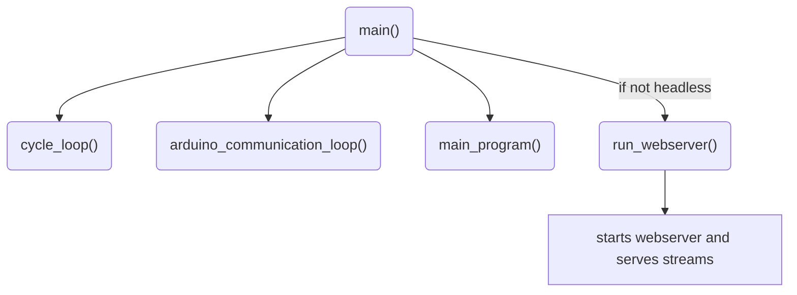

To coordinate between the asynchronous loops, the system uses two main classes:

- `Car`, which describes the instantaneous state of the vehicle, and

- `SharedState`, which holds all shared data, flags, and vision results.

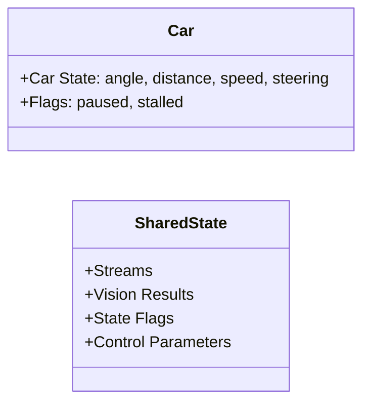

The `run_webserver()` function starts a web server that serves camera streams and robot telemetry. This loop runs only if the program is not in headless mode.

The `cycle_loop()` handles image acquisition and processing. It continuously captures frames from the camera, applies filtering (extracting red, green and pink stream using hsv and then [Thresholding](https://docs.opencv.org/4.x/d7/d4d/tutorial_py_thresholding.html)), and detects edges using [Canny Edge detection](https://docs.opencv.org/4.x/da/d22/tutorial_py_canny.html). If headless mode is off, the processed frames are visualized in real time.

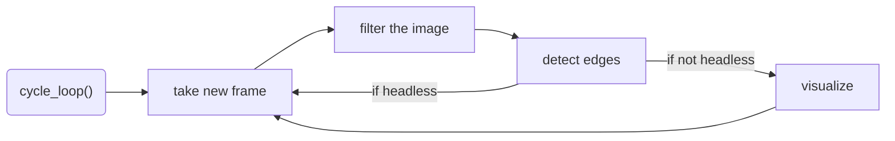

The `arduino_communication_loop()` manages low-level communication with the Arduino. It waits for the Arduino to connect via serial, sends speed and steering commands, and receives angle and distance readings. The loop continuously updates the `Car` class with the latest sensor data.


To communicate with the Arduino, we use the `pyserial` library. The Arduino is programmed to receive speed and steering commands via serial communication and send back angle and distance measurements. The communication protocol is simple: the Raspberry Pi sends a formatted string containing speed and steering values, and the Arduino responds with a formatted string containing angle and distance readings. [Here](raspberry_pi/arduino_comm.py) you can find more information about the communication protocol and its implementation. <!-- Todo: Create the document link if necessary -->

The `main_program()` controls the high-level challenge logic. It waits for the Arduino to connect and for the start switch to be enabled. Once started, it decides whether to execute pillar round logic or obstacle challenge logic based on the challenge type.


### Opening Race


We begin by determining the `round direction`. First, we crop the top half of the image and filter out all black pixels using OpenCV's [`cv2.inRange`](https://docs.opencv.org/4.x/da/d97/tutorial_threshold_inRange.html) function. On this Boolean map of black pixels, we detect edges using [`cv2.Canny`](https://docs.opencv.org/4.x/da/d22/tutorial_py_canny.html). By applying `np.argmax`, we find the heights of the walls in pixels at each x-coordinate in the image. The discrete differences between these heights are calculated using `np.diff`, raised to the fourth power, and summed up. This helps us identify the jump in wall height when the inner wall first appears.

For driving, we employ a PD-Controller in `pd_middle`. The input is derived from the black portion of a region-of-interest extracted from the outer edges of the black-and-white Boolean image. This is compared to a pre-calibrated fixed portion. We follow only the outer wall to avoid collisions with the inner walls, especially if their gap distance is randomized to be small.


The red outlines show the region of interest used for wall detection.

Using a small region of interest in the center of the camera feed, we detect the blue and orange lines on the game mat. The color image is converted to HSV for this purpose. Upon encountering such a line, depending on its color, we initiate a turn and decrement the remaining corners counter, allowing us to accurately stop at the end of the round.

<!-- Todo add image -->

---

### Obstacle Race

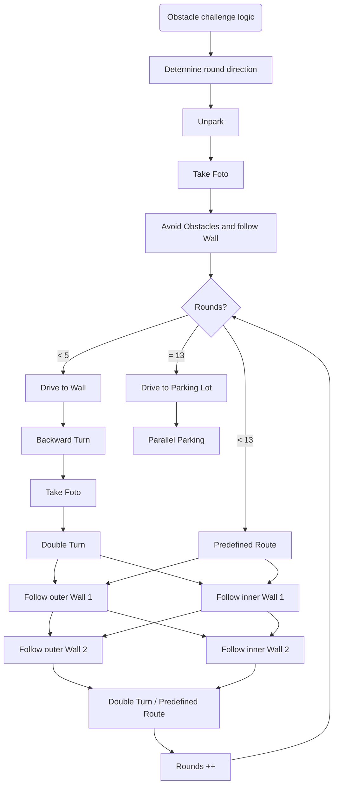

First we determine the `round direction` based on how much black we see on each side in the blue ROI. <!-- Todo: add image --> Then we `unpark` by performing a turning sequence. Before starting to drive the rounds we evaluate the current image for pillars and decide whether we have to avoid a pillar. The robot continues driving until it is near to the wall. Then it takes a backward turn to realign itself and starts driving again. After taking  another picture we evaluate the pillars again.

<!-- todo add image -->

If there are pillars, it performs a double turn to avoid the pillars and then continues following the correct wall. If there are two pillars, the robot will change side in the middle of the section. After another double turn we increment the rounds counter

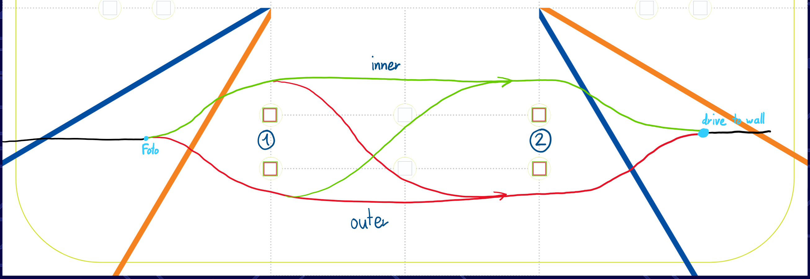

After completing 5 rounds, the robot follows predefined routes for each round. After completing 13 rounds, the robot drives to the parking lot and performs parallel parking.

#### Colour Detection

In addition to extracting a black-and-white image, we convert the cropped color image to HSV. This conversion allows us to more easily and robustly extract red and green pixels. We then use [`cv2.Canny`](https://docs.opencv.org/4.x/da/d22/tutorial_py_canny.html) and [`cv2.findContours`](https://docs.opencv.org/3.4/d4/d73/tutorial_py_contours_begin.html) to search for contours in this image. The centroids of the contours are extracted and stored along with their width and height.

When handling the HSV color space, special care is needed for colors near the red hue due to the wrap-around effect. The hue value for red is around 0° and 360°, meaning it wraps around the HSV color wheel. To accurately detect red, we create two separate masks: one for the lower range (e.g., 0° to 10°) and another for the upper range (e.g., 350° to 360°). These masks are then combined to form a single mask that accurately captures all red hues. This approach ensures that all shades of red are detected, avoiding issues caused by the hue value wrapping around the color wheel.

.jpeg>) <!-- todo add new image -->

In the image above you can see the robot detecting the red and green pillars. After processing the image, the program returns a list of found pillars, sorted by their distance to the robot. The robot then drives towards the closest pillar, until it is close enough to the pillar to avoid it. The robot then drives around the pillar and continues to the next one. You can also see the center ROI used for detecting turn marking lines.

#### Wall Following

We follow the walls using the point-slope-form of the border line between the black wall and the white mat. This is again extracted using [`cv2.Canny`](https://docs.opencv.org/4.x/da/d22/tutorial_py_canny.html). We use the PD controller to keep the y-intercept of the lines on a constant height. By including the gyro values quadratically in the steering calculation, we can further stabilise the driving so that the robot does not take a U-turn. Furthermore there is a corner detection algorithm that switches the wall following to gyro corrected driving, when passing the end of the walls. <!-- todo add image of robot reaching edge -->

---

## Own platform for streams

We created our own HTML file to display the camera image. This is used to send three streams constantly to our connected device in preparation mode. During the competition, we disable the communication so that the raspberry can use all its computational resources for the run. Using the streams limits the performance of the robot as much time is spent on sending the streams. Therefore, we disable it.
With our HTML file, we can also read out the color values of the environment and send these changes directly to the robot. We can change the different streams via websocket and thus display images with different filters on them.

|  |  |
|-----------------------------|-----------------------------|

---

## Firmware Running on the Arduino

The Arduino interfaces directly with the DC motor, servo, gyro sensor, switches, and status LED. Its primary role is to exchange sensor data and control commands between these peripherals and the Raspberry Pi. To support this, we implemented a custom firmware tailored to the robot’s needs.

The high-level program flow is illustrated below:

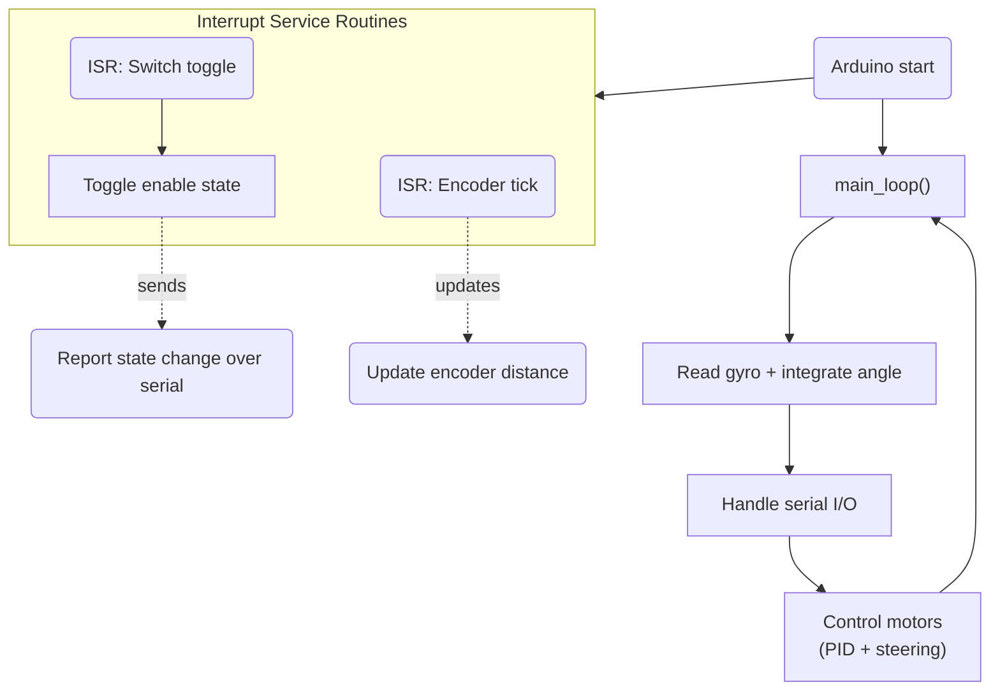

### Overview of custom Firmware Operation

At startup, the Arduino initializes the serial connection, configures motor and servo pins, and attaches interrupt handlers for the encoder signals and the enable switch.
When the enable switch changes state, the corresponding interrupt fires and the new state is immediately sent to the Raspberry Pi.

The **main loop** performs four continuous tasks:

1. **Gyro reading and angle integration**
   The Arduino reads the angular velocity from the gyro and integrates it to estimate the robot’s heading. A custom temperature compensation model is applied to increase accuracy.

2. **Serial communication**
   The current heading and encoder-based distance are sent to the Raspberry Pi.
   At the same time, the Arduino receives speed and steering commands from the Pi.

3. **Motor and steering control**

   - The servo angle is set directly.
   - The DC motor speed is regulated using a PID controller, which keeps the velocity stable even under load.
     The PID feedback signal is derived from the encoder distance change over time.

4. **Safety and diagnostics**
   The firmware monitors conditions that indicate mechanical issues:

   - **Stall detection:**
     If the encoder shows almost no movement while the PID demands maximum PWM, the robot is considered stalled.
     In this case, the motor is shut down to prevent overheating, and an error message is sent to the Raspberry Pi.
   - **Current sensing:**
     The MC33926 motor driver provides analog current feedback.
     Although this feature is not highly reliable for small motors, it acts as an additional emergency-level safeguard.

Together, these systems ensure that the Arduino can reliably control the robot’s drivetrain, report accurate sensor data, and react quickly to unsafe conditions.

---

<!-- Pictures of the team and robot must be provided. The pictures of the robot must cover all sides of the robot, must be clear, in focus and show aspects of the mobility, power and sense, and obstacle management. Reference in the discussion sections 1, 2 and 3 can be made to these pictures. Team photo is necessary for judges to relate and identify the team during the local and international competitions. -->

## Photos

| 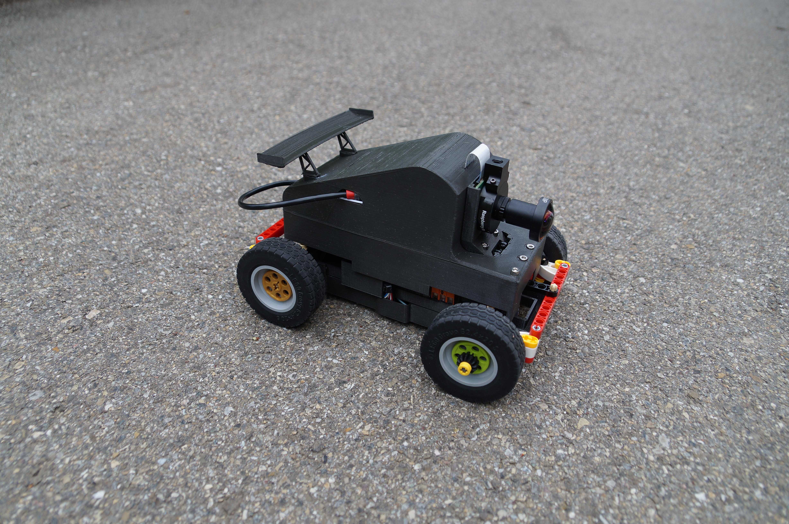 | 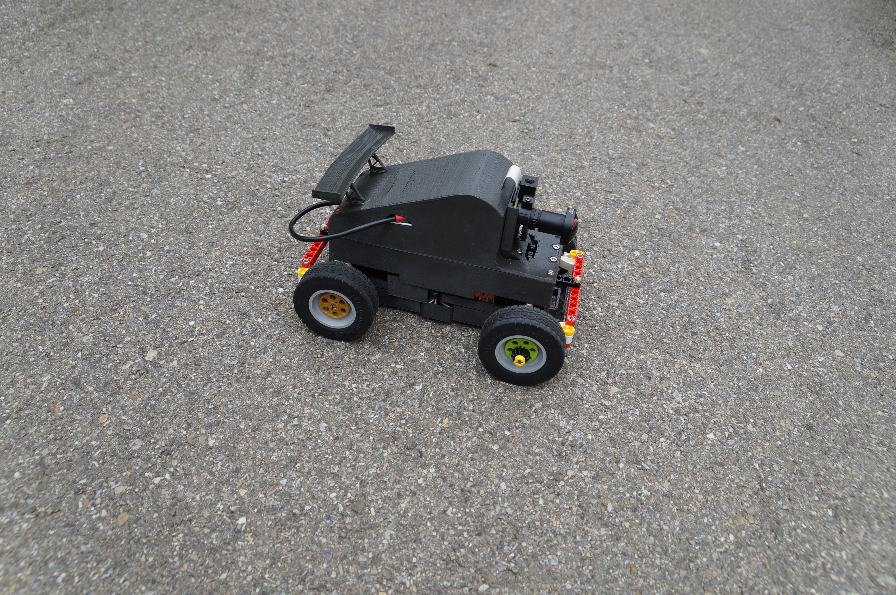 |
|---------------------------------|---------------------------------|
| 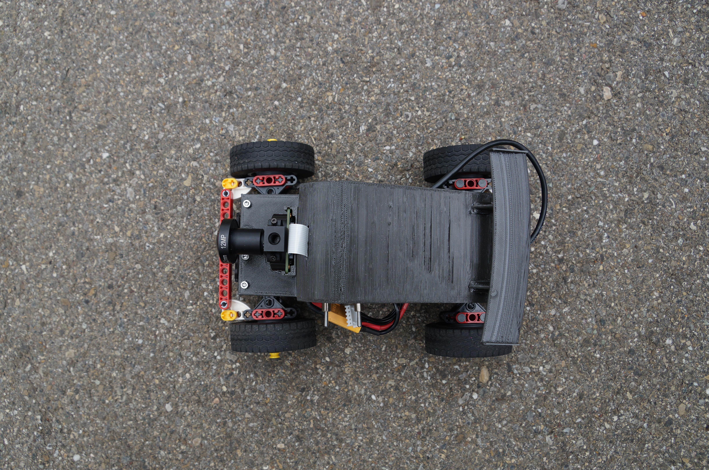 | 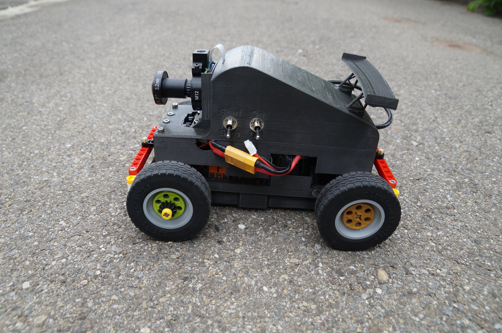 |
| 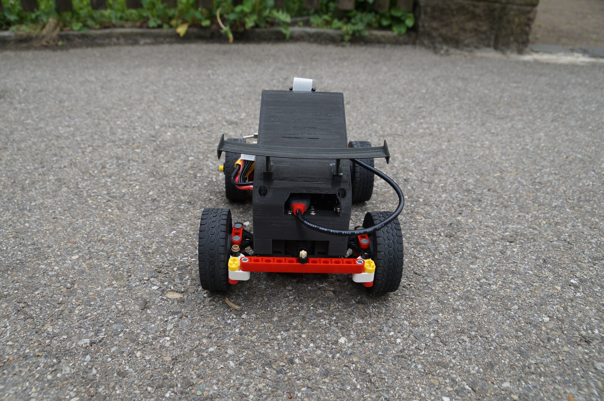 | 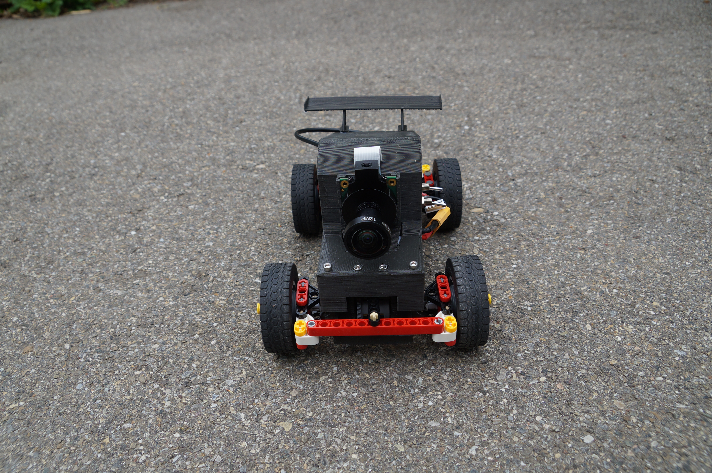 |
|  |  |
| 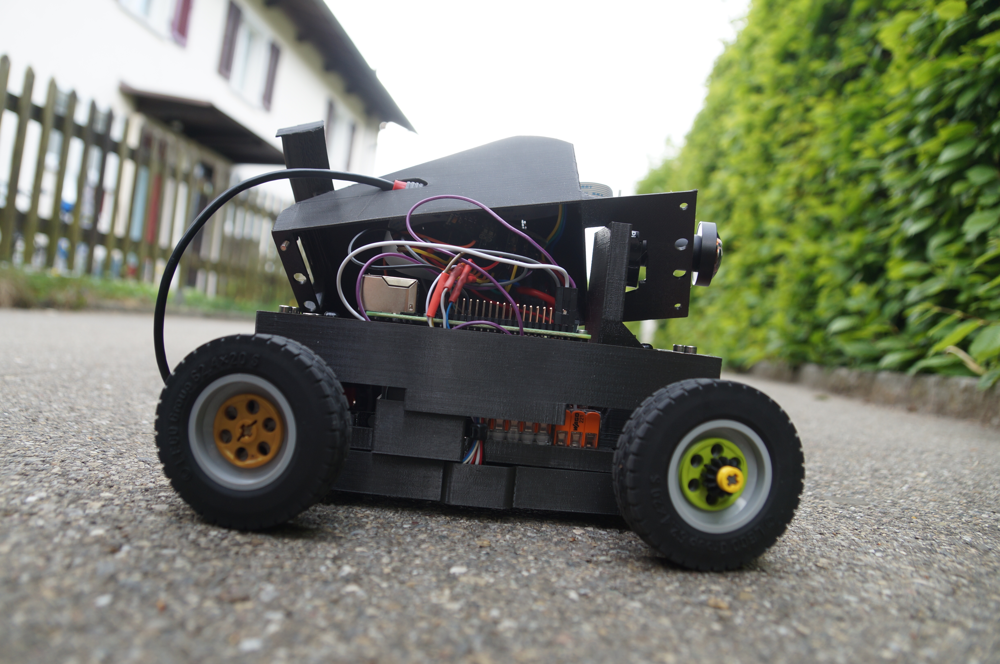 | 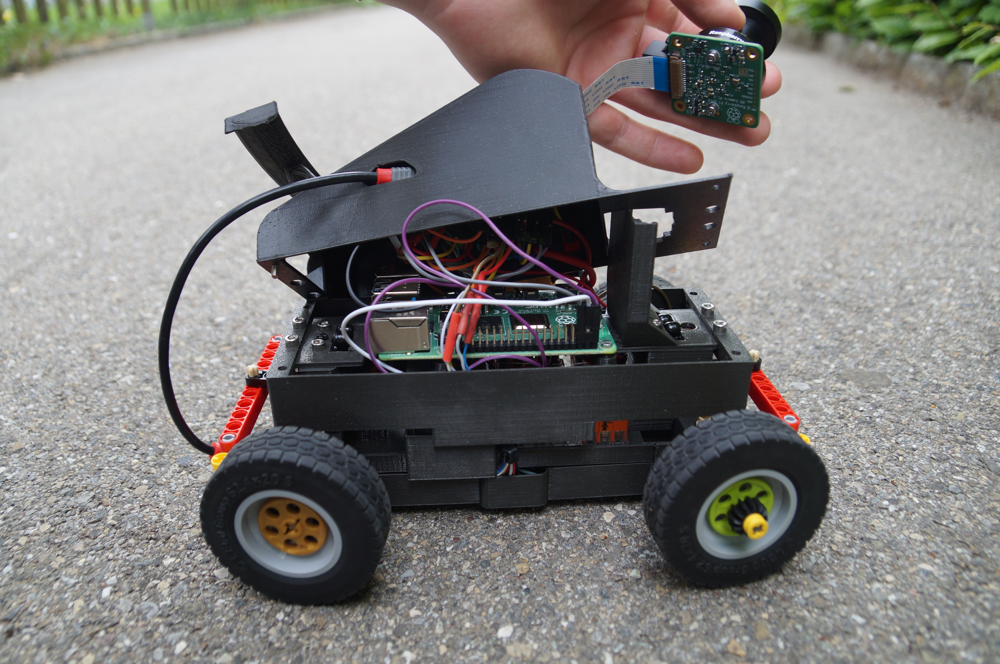 |
 


|  | |
|----------------------------------------|---------------------------------------|

**The national menu of Switzerland is fondue. While usually fondue is made from cheese, the team is enjoying a robot fondue 😎🤪**

<!-- The performance videos must demonstrate the performance of the vehicle from start to finish for each challenge. The videos could include an overlay of commentary, titles or animations. The video could also include aspects of section 1, 2 or 3 -->

## Videos

<!-- https://michaelcurrin.github.io/badge-generator/#/generic -->


[](https://youtu.be/OofLgNROook)

[](https://youtu.be/P_mGKfEbACU) 

---

## Enabling Reproducibility

To enable the reproduction of our robot, we provide the following installation instructions:

1. Install raspberry pi os on your raspberry pi using the [official guide](https://www.raspberrypi.org/documentation/installation/installing-images/README.md) While the os is installing, you can flash the arduino code to the arduino nano. The arduino code can be found in the [src](/src) folder. The code can be uploaded using platformIO.
2. After booting up the raspberry pi, connect via ssh, and install the following packages:

```bash
sudo apt-get update
sudo apt-get install python3-opencv python3-websockets python3-numpy python3-pyserial
```

3. Enable the camera using `sudo raspi-config` and reboot the raspberry pi for the changes to take effect. Install the corresponding python module:

```bash
sudo apt-get install python3-picamera2
```

4. Clone the repository and run the main script:

```bash
git clone https://github.com/flawil-beavers/Future-Engineers_2025.git
```

5. Running the robot in dev mode

Check in the config file, if the correct usb port is set for the arduino. Check the correct port with `ls /dev/tty*` and look for the port that is connected to the arduino. Change the port in the config file to the correct port.

Make sure pillars are enabled/disabled in the config file, and that no fixed round direction is set.

Navigate to the `raspberry_pi` directory and run the main script:

```bash
cd Future-Engineers_2025/raspberry_pi
python3 roi.py
```

To launch the robot, open the web interface in your browser and start the robot by clicking the connect button. The robot will now start driving autonomously. To stop the robot, you can close the web interface, press the stop button on the robot or press `ctrl+c` in the ssh session.

6. For future running

To make the progam executable run the following commands in the `raspberry_pi` folder:

```bash
chmod +x main.py
```

<!-- $env:MERMAID_BIN="C:\Users\philk\AppData\Roaming\npm\mmdc.cmd"
pandoc README.md -o README.pdf --pdf-engine=xelatex -V mainfont="Segoe UI Emoji" --filter pandoc-mermaid -->
